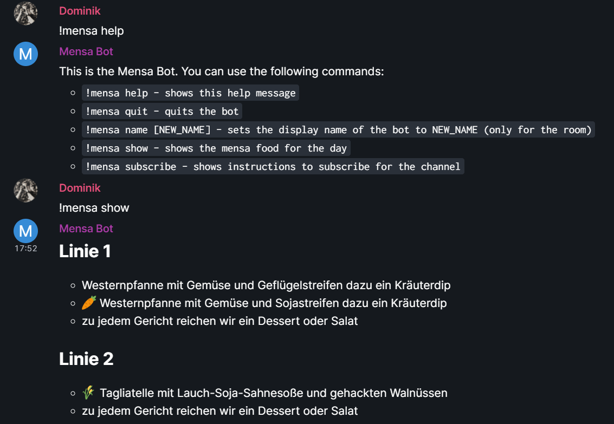

# MensaBot - A bot that reminds you of your food in your canteen

This bot sends you a daily reminder of the current food in your canteen (dt. mensa).
Additionally, you can use commands to request the listing directly.

## Features

* Schedule daily posts about the food in your canteen
* Request summary of food in your mensa (at the current date)
* Change display name per room
* Simple rights management (only configured admins can interact with the bot)

### Supported APIs
This bot aims to support multiple canteen APIs. For details about the implementation, take a look at [Development](#development).

Currently, the bot supports the following mensa:
* [Studierendenwerk Karlsruhe](https://www.sw-ka.de/en/hochschulgastronomie/speiseplan/)

## Setup

1. Get a matrix account for the bot (e.g., on your own homeserver or on `matrix.org`)
2. Prepare configuration:
    * Copy `config-sample.json` to `config.json`
    * Enter `baseUrl` to the matrix server and `username` / `password` for the bot user
    * Add yourself to the `admins` (and delete my account from the list :))
3. Either run the bot via jar or run it via the provided docker.
    * If you run it locally, you can use the environment variable `CONFIG_PATH` to point at your `config.json` (defaults to `./config.json`)
    * If you run it in docker, you can use a command similar to this `docker run -itd -v $LOCAL_PATH_TO_CONFIG:/usr/src/bot/data/config.json:ro ghcr.io/dfuchss/mensabot`

## Usage

* An admin can invite the bot to an *unencrypted* room. If the room has enabled encryption or if the invite was not sent by an admin, the bot ignores it (without logging it)
* After the bot has joined use `!mensa help` to get an overview about the features of the bot (remember: the bot only respond to admin users)
* In order to get daily notifications about the food in your canteen, simply use `!mensa subscribe`. This command will print the room id of the current room into the channel. Add this channel to the
  list in the config and restart the bot.

## Development

Join our discussion at our matrix channel [#mensa-bot:fuchss.org](https://matrix.to/#/#mensa-bot:fuchss.org)

* The bot is build using the [Trixnity](https://trixnity.gitlab.io/trixnity/) framework.
* The basic functionality is located in [Main.kt](src/main/kotlin/org/fuchss/matrix/mensa/Main.kt). There you can also find the main method of the program.
* Every canteen that shall be considered has to implement the `CanteenAPI`. Currently, there is only one implementation for
  the [sw-ka.de interface](https://sw-ka.de).
